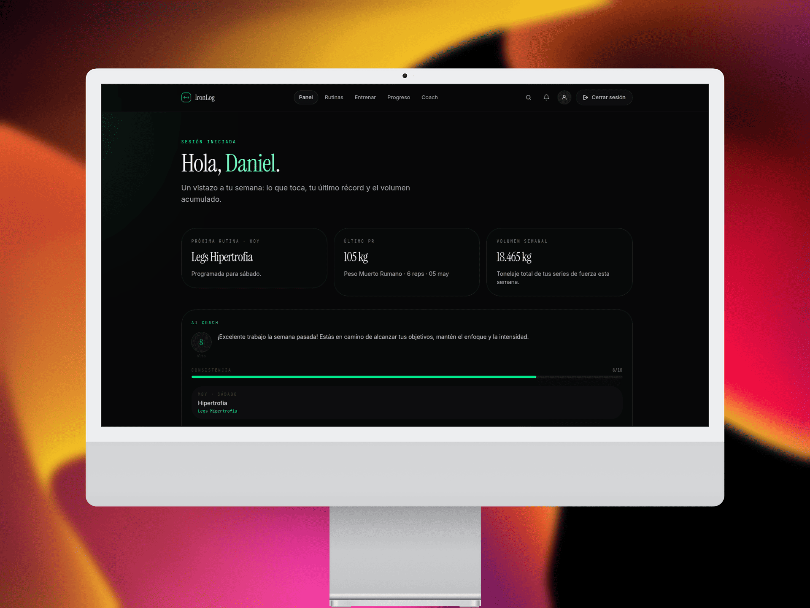
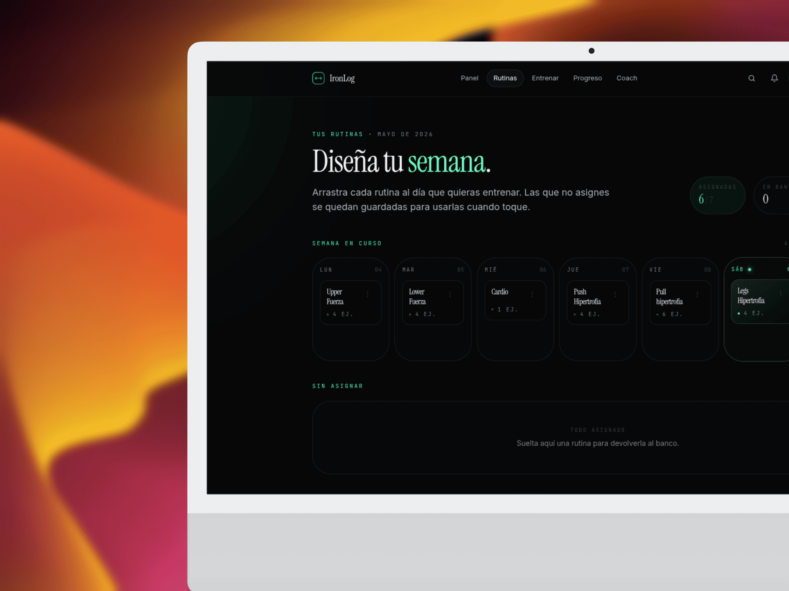
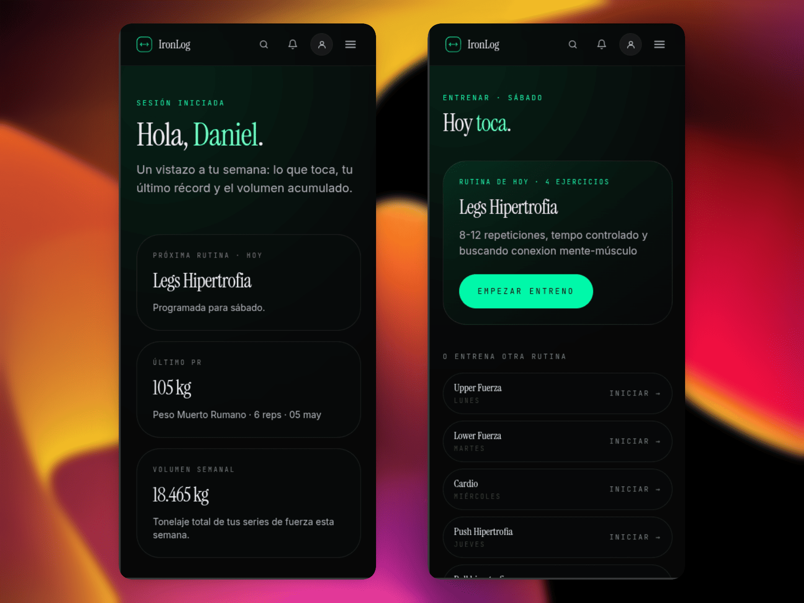

<div align="center">
  
  # 🏋️‍♂️ IronLog
  
  **Lift. Log. Level up.**
  
  *El rastreador de fitness social definitivo para el entrenamiento de fuerza. Diseña rutinas, registra tus entrenamientos en tiempo real, analiza tu progreso y comparte tu evolución con la comunidad.*

  <p align="center">
    
    
    
    
  </p>

</div>

---

## 📱 Vistazo Rápido (Mockups)

<details open>
<summary>💻 Ver vistas de Escritorio</summary>
<br>

<p align="center">
  <strong>Dashboard</strong><br>
  
</p>
<br>

<p align="center">
  <strong>Entrenar</strong><br>
  
</p>
<br>

<p align="center">
  <strong>Progreso</strong><br>
  
</p>

</details>

<details open>
<summary>📱 Ver vistas Móviles</summary>
<br>
<p align="center">
  
  &nbsp;&nbsp;&nbsp;&nbsp;
  
</p>
</details>

---

## ✨ Características Principales

IronLog no es solo una app de notas para el gimnasio, es tu compañero completo de entrenamiento:

- 📋 **Rutinas Personalizadas** — Diseña tus propias plantillas de entrenamiento y asígnalas estratégicamente a los días de la semana.
- ⚡ **Sesiones en Vivo** — Empieza a entrenar con un solo clic. Añade ejercicios sobre la marcha y registra tus series, repeticiones y pesos en tiempo real.
- 🏋️ **Flexibilidad Total** — Soporte nativo para ejercicios de fuerza (peso × reps), peso corporal, isométricos (tiempo) y cardio (distancia).
- 🏆 **Récords Personales (PRs) Inteligentes** — Detección automática de tus mejores marcas por ejercicio. ¡Celebra tus victorias mientras los PRs antiguos se degradan automáticamente!
- 📊 **Analítica Avanzada** — Visualiza tu éxito con un dashboard completo: volumen semanal, mapa de calor (heatmap) de actividad, distribución muscular y curvas de progreso detalladas.
- 🤝 **Ecosistema Social** — Mantén la motivación alta. Sigue a tus amigos (con soporte para perfiles privados), revisa el feed de actividad y comparte tus logros.

---

## 🛠 Stack Tecnológico

IronLog está construido con las últimas tecnologías del ecosistema web para garantizar un rendimiento ultrarrápido y una experiencia de desarrollador de primer nivel:

* **Framework:** [Next.js 16](https://nextjs.org) (App Router, Turbopack)
* **Lenguaje:** TypeScript 5
* **Interfaz:** React 19, Tailwind CSS v4
* **Backend & Auth:** [Supabase](https://supabase.com) (PostgreSQL + RLS + Auth)
* **Mutaciones de Datos:** Next.js Server Actions (`"use server"`)
* **Gestión de Formularios:** `useActionState` + `useFormStatus` (React 19)
* **Testing:** Vitest + Testing Library + jsdom

> 💡 **Minimalismo Técnico:** Este proyecto abraza la simplicidad nativa de Next.js. **No** utilizamos dependencias pesadas como shadcn/ui, React Query, tRPC, Jest, MSW ni rutas `/api` tradicionales.

---

## 🎨 Filosofía de Diseño

El diseño de IronLog es **oscuro, editorial y con estilo Apple**. 
Todos los *tokens* de diseño viven en `app/globals.css` utilizando el nuevo sistema `@theme` de Tailwind v4.

| Elemento | Descripción |
| :--- | :--- |
| **Neutrales** | `ink-50` a `ink-950` (Del blanco roto a un negro profundo). |
| **Acentos** | `mineral` (verde brillante para CTAs) y `ember` (rojo cálido para alertas/destrucción). |
| **Tipografía** | Titulares elegantes con serif (**Instrument**) y cuerpos ultra legibles con sans (**Geist**). |
| **Efectos UI** | Clases de utilidad únicas como `.aurora` (fondos animados), `.grid-texture` y `.hairline` (bordes sutiles de 1px). |

---

## 🗄️ Arquitectura de Base de Datos

Gobernada por Supabase y protegida férreamente por **Row Level Security (RLS)**.

<details>
<summary>Ver esquema de tablas principales</summary>

| Tabla | Propósito |
|-------|-----------|
| `profiles` | Metadatos de usuario (sincronización automática con `auth.users`). |
| `exercises` | Catálogo global de ejercicios (incluye seed inicial). |
| `routines` | Plantillas de entrenamiento guardadas por cada usuario. |
| `routine_exercises`| Relación de ejercicios dentro de una plantilla (ordenados). |
| `sessions` | Registro de sesiones (`active`, `completed`, `discarded`). |
| `session_exercises`| Los ejercicios realizados en una sesión específica. |
| `sets` | El nivel más granular: series con reps, peso, tiempo o distancia. |
| `follows` | Grafo social para la red de usuarios (`pending`, `accepted`). |

⚡ **Magia en el Backend:** - Denormalización inteligente: El `user_id` se inyecta automáticamente en relaciones profundas vía triggers.
- Cálculo de PRs: La columna `sets.is_pr` se calcula silenciosamente mediante un trigger `BEFORE INSERT`.
- Seguridad Total: Las consultas desde el cliente confían ciegamente en el RLS de Supabase.

</details>

---

## 🚀 Primeros Pasos

¿Quieres correr IronLog en tu máquina local? Es muy sencillo:

### 1. Requisitos previos
* [Node.js](https://nodejs.org/) (v18 o superior)
* Proyecto activo en [Supabase](https://supabase.com)

### 2. Instalación

```bash
git clone [https://github.com/tu-usuario/ironlog.git](https://github.com/tu-usuario/ironlog.git)
cd ironlog
npm install